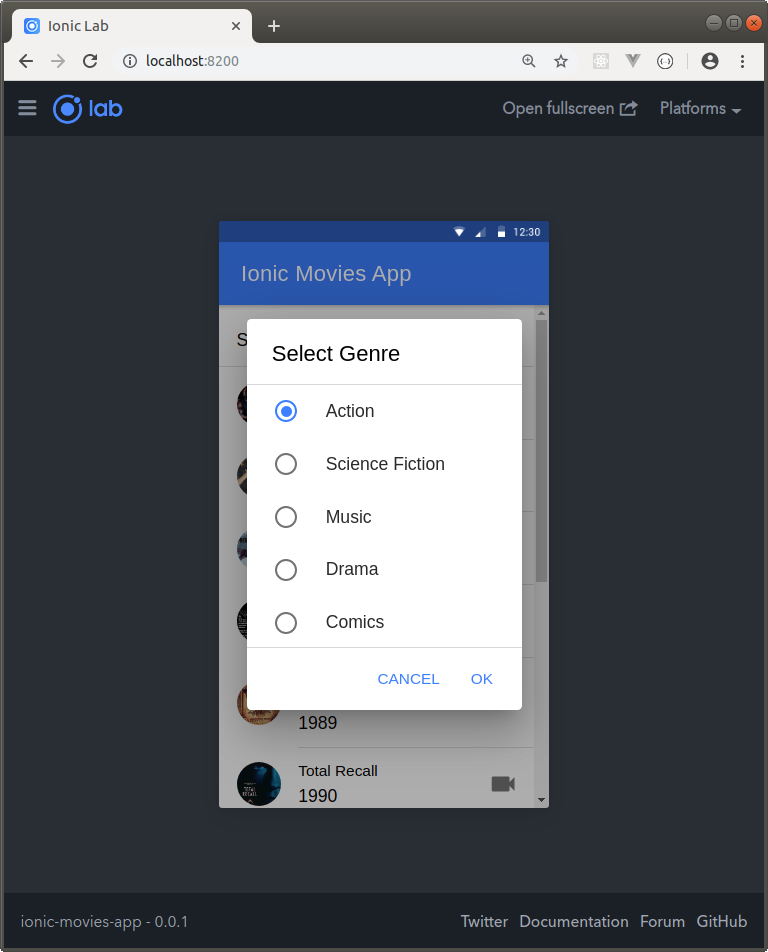
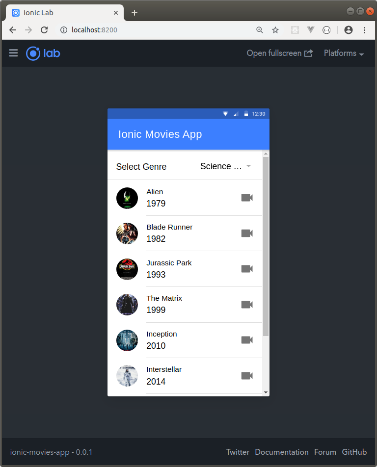
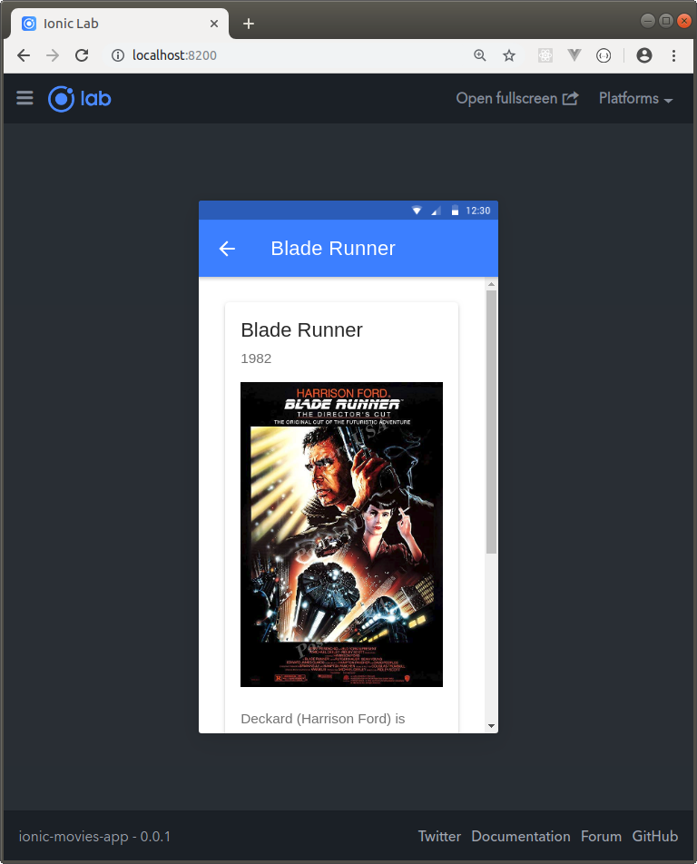

IONIC MOVIES APP
--------------------------------------------------------------------------------------------------------------------

Aplicación desarrollada con Ionic 4 que despliega información de películas.

La aplicación utiliza el HttpClientModule para conectarse a una API Rest desarrollada con Node/Express y que permite almacenar la información en una base de datos PostgreSQL:

**MOVIES REST API WITH NODE AND EXPRESS**

https://github.com/edgar-code-repository/node-express-movies-rest-api

--------------------------------------------------------------------------------------------------------------------

**Ejecución usando Ionic Lab**

Selección de genre para despliegue de películas:

Pantalla que despliega listado de películas:

Pantalla que despliega detalle de una película:

--------------------------------------------------------------------------------------------------------------------